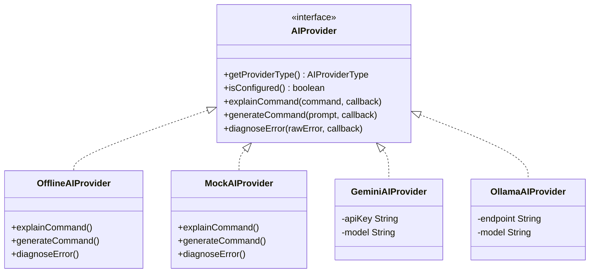

# MadMax AI Provider Guide & Extensibility

MadMax Command Intelligence is designed around a provider-agnostic engine architecture, enabling zero-latency offline usage while accommodating future cloud and local LLM backends.

---

## 1. Provider Ecosystem

---

## 2. Implemented Provider Types

| Provider | Type | Network Required? | Privacy Boundary | Latency |
|---|---|:---:|:---:|:---:|
| **Offline Built-in Engine** | `OFFLINE_HEURISTIC` | ❌ No | 🟢 100% On-Device | `< 1ms` |
| **Mock Simulation** | `MOCK` | ❌ No | 🟢 100% On-Device | `~400ms` |
| **Google Gemini Pro** | `GEMINI` | 🌐 Yes | Cloud API (Explicit opt-in) | `~800ms` |
| **Local Ollama** | `OLLAMA` | 🏠 Local LAN/Device | Private Localhost | `~1200ms` |
| **OpenAI GPT-4o** | `OPENAI` | 🌐 Yes | Cloud API (Explicit opt-in) | `~900ms` |

---

## 3. Registering a Custom Provider

1. Implement the `AIProvider` interface.
2. Register your provider in `AIProviderManager.java`.
3. Handle async callbacks on background worker threads and dispatch UI updates to `Handler(Looper.getMainLooper())`.
