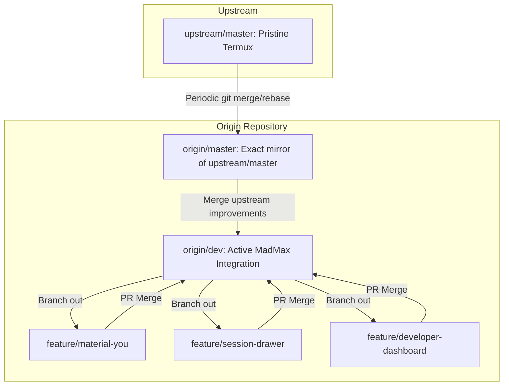

# MadMax Git Branching Strategy & Upstream Alignment

MadMax maintains a dual-branch topology to ensure rapid feature innovation while preserving 100% clean merge compatibility with upstream Termux.

---

## 1. Branch Topology



---

## 2. Branch Roles & Rules

| Branch | Role | Direct Commits Allowed? | PR Target? |
|---|---|:---:|:---:|
| **`master`** | Pristine upstream mirror of `termux/termux-app`. | ❌ Never (Fast-forward only from upstream) | ❌ Never |
| **`dev`** | Integration branch for all tested MadMax features. | ⚠️ Maintainers only | ✅ Default target |
| **`feature/*`** | Feature-specific development branches. | ✅ Yes | ➡️ Targets `dev` |
| **`fix/*`** | Bug fix branches. | ✅ Yes | ➡️ Targets `dev` |

---

## 3. Upstream Synchronization Routine

To sync upstream updates cleanly:
```bash
git checkout master
git fetch upstream
git merge --ff-only upstream/master
git push origin master

git checkout dev
git merge master
# Resolve any non-core presentation conflicts if needed
git push origin dev
```
