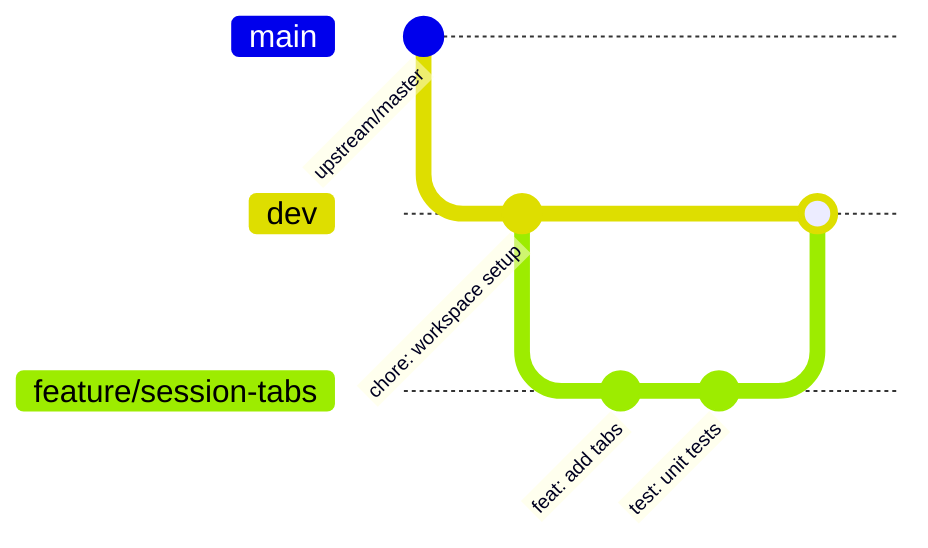

# Contributing to MadMax

Thank you for your interest in contributing to **MadMax**! We welcome improvements to the presentation layer, extension systems, developer tools, and bug fixes.

---

## 🔒 The Core Protection Rules (Mandatory)

Before contributing, understand that MadMax preserves a clean upstream boundary with Termux:

1. **Never modify `terminal-emulator/`**: The VT100 / ANSI state machine and character matrix are strictly protected.
2. **Never modify `termux.c` or `local-socket.cpp`**: Low-level Linux PTY syscalls and IPC sockets are protected.
3. **Never change `targetSdkVersion=28`**: API 28 is required for Android Linux binary execution without SELinux/W^X violations.
4. **Develop within `app/src/main/java/com/termux/app/madmax/`**: Place all new capabilities into the modular extension layer.

---

## 🌿 Branch & Development Workflow



1. **Fork & Clone** the repository.
2. **Branch from `dev`**: `git checkout -b feature/my-enhancement dev`. (Never submit PRs directly targeting `master`).
3. **Write Conventional Commits**: `feat(scope): ...`, `fix(scope): ...`, `docs(scope): ...`.
4. **Run Unit Tests & Assemble Debug APK**:
   ```bash
   ./gradlew testDebugUnitTest
   ./gradlew assembleDebug
   ```
5. **Open a Pull Request** targeting the `dev` branch.

---

## 🎨 Design & Code Standards

- **Aesthetics:** Follow Material 3 guidelines (`Theme.Material3.DayNight.NoActionBar`).
- **Dynamic Colors:** Always support Monet color extraction on Android 12+ while maintaining dark terminal contrast.
- **Java Style:** 4-space indent, `mField` naming for private members, explicit nullability annotations (`@NonNull`, `@Nullable`).
