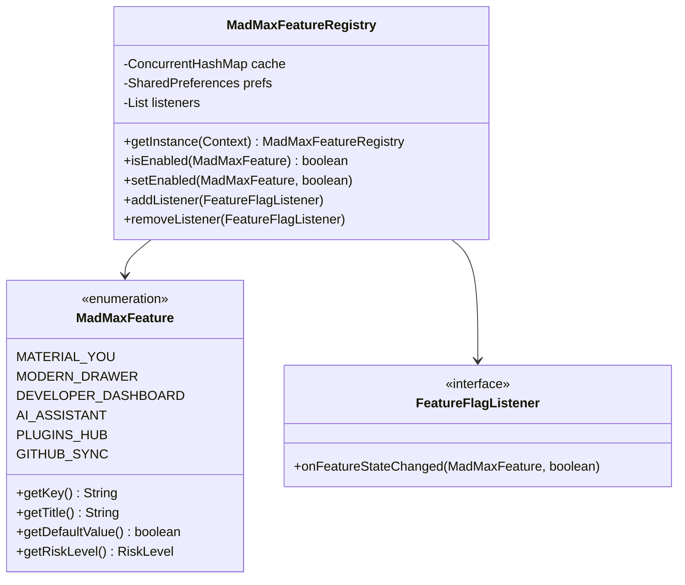

# MadMax Feature Flag & Extension Registry Guide

The MadMax Feature Registry provides dynamic runtime toggling of experimental and preview features, backed by persistent `SharedPreferences` and asynchronous listener dispatches.

---

## 1. Registry Architecture



---

## 2. Using Feature Flags in Code

### 2.1 Checking if a Feature is Enabled
```java
MadMaxFeatureRegistry registry = MadMaxFeatureRegistry.getInstance(context);
if (registry.isEnabled(MadMaxFeature.AI_ASSISTANT)) {
    // Initialize or render AI suggestions bar
}
```

### 2.2 Listening for Live Flag Changes
```java
MadMaxFeatureRegistry.getInstance(context).addListener((feature, isEnabled) -> {
    if (feature == MadMaxFeature.MATERIAL_YOU) {
        // Recreate activity to apply updated theme
        activity.recreate();
    }
});
```

### 2.3 Registering a New Feature
1. Add a new enum constant to [`MadMaxFeature.java`](file:///workspaces/Madmax/app/src/main/java/com/termux/app/madmax/features/MadMaxFeature.java).
2. Assign a unique key, title, description, default state, and risk level (`LOW`, `MODERATE`, `HIGH`).
3. Add a corresponding `SwitchPreferenceCompat` in the relevant preference XML under `app/src/main/res/xml/`.
