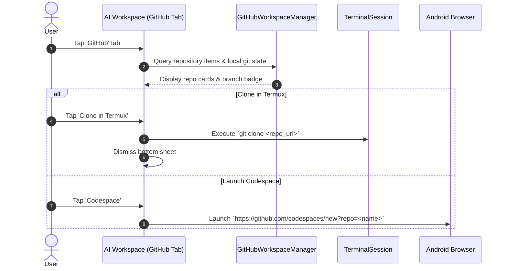

# MadMax GitHub Workspace Hub

The GitHub Workspace Hub connects MadMax with your GitHub developer workflow directly inside the terminal app.

---

## 1. Features & Capabilities

- **Repository Directory:** Curated list of popular and active repositories with description, star counts, and default branch badges.
- **1-Tap Terminal Clone:** Automatically generates and executes `git clone <url>` directly in your active terminal session.
- **GitHub Codespaces Launcher:** 1-tap browser intent launching cloud developer environments with full containerized toolchains.
- **Local Git Tracker:** Scans current terminal working directory to extract active branch and recent commit SHA.

---

## 2. Integrated Workflow

