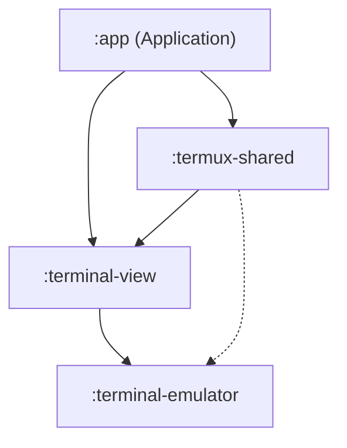
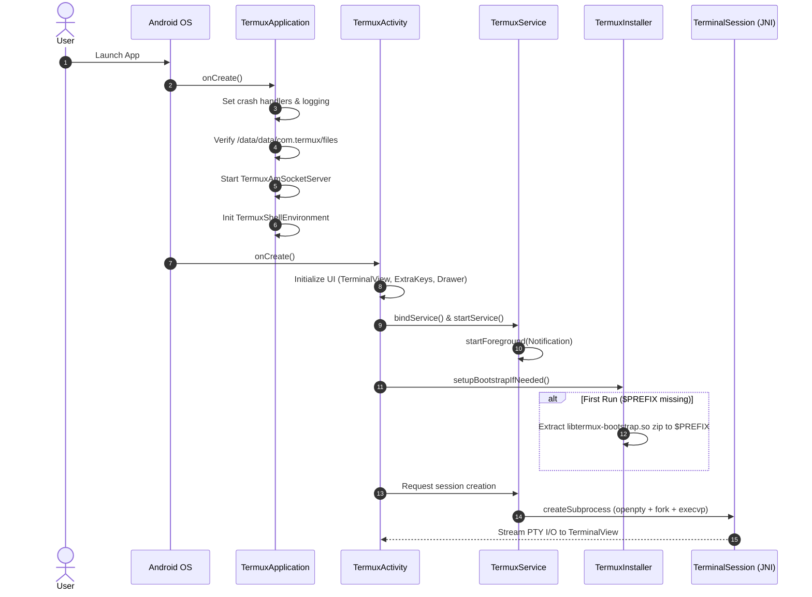

# MADMAX / Termux Architectural Blueprint

> **Document Version:** 1.0.0  
> **Target Base:** Termux Android Application (`v0.118.0` / Android Gradle Plugin 8.13.2 / Gradle 9.2.1)  
> **Generated:** 2026-08-16  

---

## Executive Summary

The project is an advanced Linux terminal emulator and environment execution platform for Android. It operates by managing pseudo-terminal (PTY) master/slave pairs natively, hosting an isolated POSIX userland environment in the application's private internal storage directory (`/data/data/com.termux/files/usr`), and coupling a VT100/ANSI terminal state machine with an Android Canvas rendering surface.

```
+-------------------------------------------------------------------------------+
|                                  Android OS                                   |
+-------------------------------------------------------------------------------+
       |                                                ^
       v                                                |
+----------------------+                       +--------------------------------+
|  TermuxActivity      |<=====================>|  TermuxService (Foreground)    |
|  (UI / View Layer)   |   Local Binder IPC    |  - TerminalSessions Manager    |
|  - TerminalView      |                       |  - Background AppShells        |
|  - Drawer & Toolbar  |                       |  - Wakelocks & WifiLocks       |
+----------------------+                       +--------------------------------+
       |                                                |
       v                                                v
+----------------------+                       +--------------------------------+
|  terminal-view       |                       |  terminal-emulator             |
|  - TerminalRenderer  |                       |  - TerminalEmulator (VT100)    |
|  - GestureRecognizer |                       |  - TerminalBuffer / TerminalRow|
+----------------------+                       +--------------------------------+
                                                        |
                                                        v (JNI / termux.c)
                                               +--------------------------------+
                                               |  Linux PTY Subsystem (openpty) |
                                               |  - /system/bin/sh or $PREFIX/  |
                                               |    bin/bash / zsh / custom     |
                                               +--------------------------------+
```

---

## 1. Gradle Module Decomposition

The project is structured as a multi-module Gradle project containing four key modules:

```
Madmax (Root)
 ├── app (Application Module)
 ├── termux-shared (Shared Library Module)
 ├── terminal-view (UI Rendering Library Module)
 └── terminal-emulator (Core Terminal Engine Module)
```

### Module Dependency Matrix



### 1.1 `:terminal-emulator` (Pure Terminal Engine)
* **Namespace:** `com.termux.emulator`
* **Artifact Output:** `com.termux:terminal-emulator:0.118.0` (AAR & Maven publication)
* **Purpose:** Headless VT100/Xterm terminal state machine and POSIX process controller. It contains **zero Android View/UI dependencies** and only depends on Android annotations and standard Java/JNI.
* **Native Components:** `src/main/jni/termux.c` compiled with `ndkBuild`.
* **Key Responsibilities:**
  * Byte stream parsing of ANSI escape sequences (CSI, OSC, DEC Private modes).
  * 2D circular scrollback and character buffer management (`TerminalBuffer`, `TerminalRow`).
  * Process spawning via `fork()`, `execvp()`, and `openpty()`.
  * Unicode combining character resolution and character width calculations (`WcWidth`).
  * Keystroke translation to escape code byte streams (`KeyHandler`).

### 1.2 `:terminal-view` (Terminal Canvas View & Touch Layer)
* **Namespace:** `com.termux.view`
* **Artifact Output:** `com.termux:terminal-view:0.118.0` (AAR)
* **Dependencies:** `:terminal-emulator`, `androidx.annotation`
* **Purpose:** Custom Android `View` that transforms the `terminal-emulator` memory buffer into high-performance 2D Canvas rendering and translates touch/keyboard inputs.
* **Key Responsibilities:**
  * Hardware-accelerated font glyph rendering via `TerminalRenderer`.
  * Touch event processing (pinch-to-zoom font scaling, fling scrolling, mouse tracking protocols) via `GestureAndScaleRecognizer`.
  * Contextual text selection overlays and handles (`TextSelectionCursorController`, `TextSelectionHandleView`).
  * Android IME (Input Method Editor) software keyboard protocol handling and key dispatching.

### 1.3 `:termux-shared` (Core Infrastructure & Plugin Framework)
* **Namespace:** `com.termux.shared`
* **Artifact Output:** `com.termux:termux-shared:0.118.0` (AAR)
* **Dependencies:** `:terminal-view`, `androidx.appcompat`, `com.google.android.material`, `com.google.guava`, `io.noties.markwon`, `org.lsposed.hiddenapibypass`, `commons-io:commons-io:2.5`, `com.termux:termux-am-library:v2.0.0`.
* **Native Components:** `src/main/cpp/local-socket.cpp` (Unix domain socket server).
* **Purpose:** Common architectural framework shared between Termux main app and all official Termux plugins (`Termux:API`, `Termux:Boot`, `Termux:Float`, `Termux:Styling`, `Termux:Tasker`, `Termux:Widget`).
* **Key Responsibilities:**
  * System constants and path definitions (`TermuxConstants`).
  * Configuration engines (`SharedProperties`, `TermuxAppSharedProperties`, `TermuxAppSharedPreferences`).
  * Execution engine abstraction (`ExecutionCommand`, `AppShell`, `TermuxShellManager`, `TermuxShellEnvironment`).
  * Crash handling, error reporting, and markdown diagnosis viewer (`TermuxCrashUtils`, `ReportActivity`).
  * Local Unix domain socket IPC (`TermuxAmSocketServer`).
  * Extra keys toolbar logic and key map configurations (`ExtraKeysView`, `ExtraKeysInfo`).

### 1.4 `:app` (Main Application & Orchestrator)
* **Namespace / Package:** `com.termux`
* **Artifact Output:** `termux-app_<variant>-<buildType>_<abi>.apk` / `universal.apk`
* **Dependencies:** `:terminal-view`, `:termux-shared` (and transitively `:terminal-emulator`), AndroidX components (DrawerLayout, Preference, ViewPager), Material Components, Markwon Markdown parser.
* **Native Components:** `src/main/cpp/termux-bootstrap.c`, `src/main/cpp/termux-bootstrap-zip.S` (embedded bootstrap packages inside `libtermux-bootstrap.so`).
* **Key Responsibilities:**
  * Top-level Android lifecycle components (`TermuxApplication`, `TermuxActivity`, `TermuxService`, `RunCommandService`).
  * Bootstrap zip installation and extraction orchestration (`TermuxInstaller`).
  * System integration: Storage Access Framework (`TermuxDocumentsProvider`), file sharing intents (`FileReceiverActivity`, `TermuxOpenReceiver`), system event reception (`SystemEventReceiver`).
  * Settings UI (`SettingsActivity`, `TermuxPreferencesFragment`).

---

## 2. Android Entry Points & Lifecycle Topology



### 2.1 Application Entry Point: `com.termux.app.TermuxApplication`
* **Class:** [`TermuxApplication`](file:///workspaces/Madmax/app/src/main/java/com/termux/app/TermuxApplication.java) extends `android.app.Application`
* **Execution Flow:**
  1. Sets default crash handling via `TermuxCrashUtils.setDefaultCrashHandler(this)`.
  2. Initializes logging configuration from `TermuxAppSharedPreferences`.
  3. Configures package manager variant (e.g., `apt-android-7`) via `TermuxBootstrap.setTermuxPackageManagerAndVariant()`.
  4. Loads properties from `~/.termux/termux.properties` into `TermuxAppSharedProperties`.
  5. Initializes `TermuxShellManager` singleton.
  6. Configures application dark/night theme (`TermuxThemeUtils.setAppNightMode()`).
  7. Validates and ensures accessibility of the private files root (`/data/data/com.termux/files`).
  8. Spawns `TermuxAmSocketServer` for local Unix domain socket commands.
  9. Builds and exports `TermuxShellEnvironment` (writes environment variables cache to file).

### 2.2 UI Entry Point: `com.termux.app.TermuxActivity`
* **Class:** [`TermuxActivity`](file:///workspaces/Madmax/app/src/main/java/com/termux/app/TermuxActivity.java) extends `AppCompatActivity` implements `ServiceConnection`
* **Manifest Filters:** `MAIN` / `LAUNCHER`, `LEANBACK_LAUNCHER`, `IOT_LAUNCHER` (alias `.HomeActivity`).
* **Window Properties:** `launchMode="singleTask"`, handles all runtime config changes (`orientation|screenSize|keyboard|keyboardHidden|...`).
* **Execution Flow:**
  1. Inflates [`activity_termux.xml`](file:///workspaces/Madmax/app/src/main/res/layout/activity_termux.xml) containing `DrawerLayout`, `TermuxActivityRootView`, `TerminalView`, and `TerminalToolbarViewPager`.
  2. Creates and hooks [`TermuxTerminalViewClient`](file:///workspaces/Madmax/app/src/main/java/com/termux/app/terminal/TermuxTerminalViewClient.java) to receive input, text selection, and gesture callbacks.
  3. Binds to `TermuxService` via Android `bindService()` and starts it as a foreground service.
  4. Triggers [`TermuxInstaller.setupBootstrapIfNeeded()`](file:///workspaces/Madmax/app/src/main/java/com/termux/app/TermuxInstaller.java): checks if `$PREFIX` (`/data/data/com.termux/files/usr`) is populated. If empty, extracts the embedded bootstrap zip.
  5. Once `TermuxService` is bound, retrieves active `TerminalSession` list or requests creation of a default shell session.

### 2.3 Background Process Host: `com.termux.app.TermuxService`
* **Class:** [`TermuxService`](file:///workspaces/Madmax/app/src/main/java/com/termux/app/TermuxService.java) extends `android.app.Service`
* **Nature:** Local bound and foreground service (`Service.startForeground()`). Never exported for external IPC (uses private `LocalBinder`).
* **Role:**
  * Keeps the terminal sessions and long-running shell processes alive even when `TermuxActivity` is destroyed or placed in the background.
  * Manages active terminal session collection (`List<TermuxSession> mTermuxSessions`) and background asynchronous tasks (`List<AppShell> mTermuxTasks`).
  * Manages Android `PowerManager.WakeLock` and `WifiManager.WifiLock` acquired via the notification actions or terminal commands.
  * Owns the persistent foreground notification displaying active session count and lock statuses.

### 2.4 External IPC Command Entry Point: `com.termux.app.RunCommandService`
* **Class:** [`RunCommandService`](file:///workspaces/Madmax/app/src/main/java/com/termux/app/RunCommandService.java) extends `android.app.Service`
* **Security Permission:** `com.termux.permission.RUN_COMMAND` (Protection Level: `dangerous`).
* **Role:** Receives `com.termux.RUN_COMMAND` intents from external apps (Tasker, Automate, scripts), validates execution arguments against user security settings (`allow-external-apps`), and forwards execution requests to `TermuxService`.

### 2.5 Auxiliary Providers and Receivers
| Component | Class | Purpose |
|---|---|---|
| **DocumentsProvider** | [`TermuxDocumentsProvider`](file:///workspaces/Madmax/app/src/main/java/com/termux/filepicker/TermuxDocumentsProvider.java) | Exposes `$HOME` directory to Android Storage Access Framework (Files app). Authority: `com.termux.documents`. |
| **ContentProvider** | [`TermuxOpenReceiver$ContentProvider`](file:///workspaces/Madmax/app/src/main/java/com/termux/app/TermuxOpenReceiver.java) | Exposes internal files securely to other apps via content URIs (`com.termux.files`). |
| **BroadcastReceiver** | [`SystemEventReceiver`](file:///workspaces/Madmax/app/src/main/java/com/termux/app/event/SystemEventReceiver.java) | Receives `BOOT_COMPLETED` broadcasts to wake Termux services or trigger `Termux:Boot`. |
| **Activity Aliases** | `FileShareReceiverActivity`, `FileViewReceiverActivity` | Receives Android `ACTION_SEND` and `ACTION_VIEW` intents to open external files inside Termux scripts. |

---

## 3. Terminal Engine & PTY Subsystem Location

The terminal emulation subsystem is cleanly separated into state management, byte translation, and low-level POSIX PTY interfacing:

```
terminal-emulator/
 ├── src/main/java/com/termux/terminal/
 │    ├── TerminalEmulator.java     <-- ANSI/VT100 State Machine
 │    ├── TerminalBuffer.java       <-- Circular line memory & history
 │    ├── TerminalRow.java          <-- Single row of characters & attributes
 │    ├── TerminalSession.java      <-- Session coordinator (PTY <-> Emulator)
 │    ├── ByteQueue.java            <-- Lock-free byte buffer for I/O threads
 │    ├── KeyHandler.java           <-- Key mapping & modifier translation
 │    ├── WcWidth.java              <-- Unicode character cell width table
 │    ├── TextStyle.java            <-- Character color & style encoding
 │    ├── TerminalColors.java       <-- 256-color palette + 24-bit truecolor
 │    └── JNI.java                  <-- JNI method bindings
 └── src/main/jni/
      ├── Android.mk                <-- NDK build configuration
      └── termux.c                  <-- Native PTY / fork / execvp implementation
```

### 3.1 PTY Creation & Process Lifecycle (`termux.c` & `JNI.java`)
1. **`JNI.createSubprocess(...)`** calls `termux.c:create_subprocess()`.
2. `termux.c` uses `openpty(&master_fd, &slave_fd, ...)` to allocate a pseudo-terminal pair and configures initial terminal geometry via `struct winsize`.
3. Calls `fork()`:
   * **Child Process:** Closes `master_fd`, attaches `slave_fd` to `STDIN_FILENO`, `STDOUT_FILENO`, and `STDERR_FILENO` via `dup2()`, establishes new session via `setsid()`, sets environment variables, changes directory to initial `$HOME`, and invokes `execvp()` to run the specified shell binary (default: `$PREFIX/bin/login` or `$SHELL`).
   * **Parent Process:** Closes `slave_fd`, retains `master_fd`, and returns the file descriptor integer and child PID back to `TerminalSession.java`.
4. `TerminalSession.java` spawns a background read thread consuming bytes from `master_fd` into `ByteQueue` and writes to `master_fd` when the user types.

### 3.2 Terminal State Machine (`TerminalEmulator.java`)
* Implements standard DEC/ANSI escape sequence parsing.
* Maintains two buffers:
  * **Primary Screen Buffer:** Normal terminal output with full scrollback history (`TerminalBuffer`).
  * **Alternate Screen Buffer:** Used by fullscreen terminal applications (`vim`, `tmux`, `nano`, `htop`) with scrollback disabled.
* Handles escape codes including:
  * Cursor positioning, movement, and shape.
  * SGR (Select Graphic Rendition) for 16 standard ANSI colors, 256 indexed colors, and 24-bit truecolor (`RGB`).
  * Operating System Commands (OSC) for clipboard manipulation and window title reporting.
  * Bracketed paste mode and mouse reporting modes (X10, SGR 1006).

---

## 4. Settings Architecture

Termux uses a **dual-layer configuration architecture**:

```
                       SETTINGS ARCHITECTURE
                                 │
         ┌───────────────────────┴────────────────────────┐
         ▼                                                ▼
 ┌──────────────────────────────┐        ┌──────────────────────────────┐
 │  Android SharedPreferences   │        │     Property Files (Disk)    │
 │ (XML in /data/data/.../sp/)  │        │   (~/.termux/termux.properties)│
 └──────────────┬───────────────┘        └──────────────┬───────────────┘
                │                                       │
                ▼                                       ▼
  Managed by:                            Managed by:
  - TermuxAppSharedPreferences           - TermuxAppSharedProperties
  - SettingsActivity                     - TermuxSharedProperties
  - Android Preference Fragments         - SharedPropertiesParser
                │                                       │
                ▼                                       ▼
  Stores:                                Stores:
  - UI Log Level                         - Extra Keys layout matrix
  - Crash reporting flags                - Bell action (beep, vibrate, ignore)
  - First-run bootstrap state            - Back/Volume keys behavior
  - Diagnostic preferences               - Terminal margins & font scaling
                                         - allow-external-apps toggle
                                         - Cursor style & blink rate
```

### 4.1 Layer 1: Android `SharedPreferences`
* **File:** `/data/data/com.termux/shared_prefs/com.termux_preferences.xml`
* **Classes:** [`TermuxAppSharedPreferences`](file:///workspaces/Madmax/termux-shared/src/main/java/com/termux/shared/termux/settings/preferences/TermuxAppSharedPreferences.java), [`SharedPreferenceUtils`](file:///workspaces/Madmax/termux-shared/src/main/java/com/termux/shared/settings/preferences/SharedPreferenceUtils.java).
* **UI Interface:** [`SettingsActivity`](file:///workspaces/Madmax/app/src/main/java/com/termux/app/activities/SettingsActivity.java) hosting [`TermuxPreferencesFragment`](file:///workspaces/Madmax/app/src/main/java/com/termux/app/fragments/settings/TermuxPreferencesFragment.java).
* **Scope:** Internal Android application states, logging verbosity levels, crash dialog behavior, and plugin-specific toggle states.

### 4.2 Layer 2: User Property Files (`~/.termux/termux.properties`)
* **Primary Path:** `/data/data/com.termux/files/home/.termux/termux.properties`
* **Secondary Path:** `/data/data/com.termux/files/home/.config/termux/termux.properties`
* **Classes:** [`TermuxAppSharedProperties`](file:///workspaces/Madmax/termux-shared/src/main/java/com/termux/shared/termux/settings/properties/TermuxAppSharedProperties.java), [`TermuxPropertyConstants`](file:///workspaces/Madmax/termux-shared/src/main/java/com/termux/shared/termux/settings/properties/TermuxPropertyConstants.java), [`SharedProperties`](file:///workspaces/Madmax/termux-shared/src/main/java/com/termux/shared/settings/properties/SharedProperties.java).
* **Key Properties:**
  * `extra-keys`: Matrix configuration for on-screen virtual keyboard buttons (e.g. `[['ESC','TAB','CTRL','ALT','UP','DOWN']]`).
  * `bell-character`: Action on terminal bell (`vibrate`, `beep`, `ignore`).
  * `back-key-behaviour`: Behavior of Android back button (`back` or `escape`).
  * `volume-keys-behaviour`: Behavior of hardware volume keys (`virtual` modifiers or `volume`).
  * `allow-external-apps`: Security gate allowing 3rd-party apps to trigger `RunCommandService` (`true` / `false`).
  * `terminal-cursor-style`: `block`, `underline`, or `bar`.
  * `terminal-cursor-blink-rate`: Cursor blink cycle timing in ms (0 to disable).
  * `night-mode`: Theme override (`true`, `false`, `system`).
* **Auxiliary Property Files:**
  * Color schemes: `~/.termux/colors.properties`
  * Font file: `~/.termux/font.ttf`
  * Float window properties: `~/.termux/termux.float.properties`

---

## 5. Package Identity, System Paths & Environment

### 5.1 Package Identity
* **Application Package Name:** `com.termux`
* **Target SDK Version:** `28` (Android 9.0 Pie)  
  *(Target SDK 28 is required because Android 10 / Target SDK 29+ enforces W^X memory restrictions and blocks executing binaries located in private app data directories without SELinux exec transitions).*
* **Minimum SDK Version:** `21` (Android 5.0 Lollipop)
* **Compile SDK Version:** `36` (Android 16)
* **Shared User ID:** `com.termux` (Enables shared UID and private file access across all signed Termux plugin packages).

### 5.2 Filesystem Layout
| Path Constant | Absolute Path | Description |
|---|---|---|
| `TERMUX_INTERNAL_PRIVATE_APP_DATA_DIR` | `/data/data/com.termux` | App private internal storage root |
| `TERMUX_FILES_DIR` | `/data/data/com.termux/files` | Files directory root |
| `TERMUX_PREFIX_DIR` (`$PREFIX`) | `/data/data/com.termux/files/usr` | POSIX userland sysroot (bin, lib, etc, var) |
| `TERMUX_BIN_PREFIX_DIR` | `/data/data/com.termux/files/usr/bin` | Userland executables (bash, apt, etc.) |
| `TERMUX_HOME_DIR` (`$HOME`) | `/data/data/com.termux/files/home` | User home directory (`~`) |
| `TERMUX_DATA_HOME_DIR` | `/data/data/com.termux/files/home/.termux` | User configuration, themes, extra keys |
| `TERMUX_STAGING_PREFIX_DIR` | `/data/data/com.termux/files/usr-staging` | Temp staging directory during bootstrap extraction |
| `TERMUX_STORAGE_HOME_DIR` | `/data/data/com.termux/files/home/storage` | Symlinks to Android shared storage (`termux-setup-storage`) |
| `TERMUX_APPS_DIR` | `/data/data/com.termux/files/apps` | Plugin app private directories |

---

## 6. Build Process & Bootstrap Packaging

### 6.1 Gradle Build Pipeline
* **Build System:** Gradle `9.2.1` with Android Gradle Plugin `8.13.2`.
* **NDK Build:** `ndkVersion 29.0.14206865` using `ndkBuild` with standard C11/C++ flags (`-std=c11`, `-Wall`, `-Wextra`, `-Werror`, `-Os`, `-fno-stack-protector`, `-Wl,--gc-sections`).
* **Java Compatibility:** Java 1.8 with Core Library Desugaring (`com.android.tools:desugar_jdk_libs:1.1.5`).

### 6.2 The Bootstrap Acquisition & Packaging Mechanism
1. **Task `downloadBootstraps` in [`app/build.gradle`](file:///workspaces/Madmax/app/build.gradle#L218-L237):**
   * Configured by variant: `apt-android-7` (default) or `apt-android-5`.
   * Downloads pre-built bootstrap zip archives (`bootstrap-aarch64.zip`, `bootstrap-arm.zip`, `bootstrap-i686.zip`, `bootstrap-x86_64.zip`) from official Termux releases (`termux-packages`).
   * Validates SHA-256 digests against hardcoded checksums.
2. **Native Embedding in `app/src/main/cpp`:**
   * `termux-bootstrap-zip.S` uses assembly directives (`.incbin`) to embed the architecture-specific zip file directly into the compiled native binary `libtermux-bootstrap.so`.
3. **Runtime Bootstrap Extraction (`TermuxInstaller.java`):**
   * On first launch, `TermuxInstaller` loads `libtermux-bootstrap.so` via `System.loadLibrary("termux-bootstrap")`.
   * Reads raw zip bytes from native pointer symbol `termux_bootstrap_zip`.
   * Streams zip entries into staging directory `/data/data/com.termux/files/usr-staging`.
   * Parses `SYMLINKS.txt` entry to reconstruct POSIX symlinks using `android.system.Os.symlink()`.
   * Atomically renames `usr-staging` to `/data/data/com.termux/files/usr`.

---

## 7. Directory & File Modification Safety Guide

When modifying, skinning, extending, or refactoring the codebase, consult this safety classification map:

```
                                SAFETY CLASSIFICATION
 ┌───────────────────────────────────────────────────────────────────────────────────┐
 │ 🟢 SAFE TO MODIFY        - Safe for customization, features, UI overhaul, themes  │
 │ 🟡 PROCEED WITH CAUTION  - Core orchestration; test thoroughly across lifecycles │
 │ 🔴 CRITICAL/UNTOUCHABLE  - Fragile POSIX/SELinux/JNI boundaries; DO NOT ALTER     │
 └───────────────────────────────────────────────────────────────────────────────────┘
```

| Path | Safety Level | Description & Guidelines |
|---|:---:|---|
| `app/src/main/res/` | 🟢 **SAFE** | Android layouts, drawables, colors, strings, menus. Completely safe to modify for UI re-theming, branding changes, and custom views. |
| `app/src/main/java/com/termux/app/activities/` | 🟢 **SAFE** | `SettingsActivity`, `HelpActivity`. Safe to add new activity screens or extend preference pages. |
| `app/src/main/java/com/termux/app/fragments/settings/` | 🟢 **SAFE** | Preference UI fragments. Safe to add custom configuration toggles and categories. |
| `app/src/main/java/com/termux/app/terminal/io/` | 🟢 **SAFE** | `TerminalToolbarViewPager`, `TermuxTerminalExtraKeys`, `KeyboardShortcut`. Safe to enhance on-screen keys, add toolbar pages, or customize shortcut gestures. |
| `docs/`, `art/`, `site/` | 🟢 **SAFE** | Documentation, logo artwork, and website source. Free to update. |
| `app/src/main/java/com/termux/app/TermuxActivity.java` | 🟡 **CAUTION** | UI controller holding terminal drawer, menu, and service binding. Modifiable, but maintain `ServiceConnection` lifecycle and configuration change handling. |
| `app/src/main/java/com/termux/app/TermuxService.java` | 🟡 **CAUTION** | Core foreground process keeper. Must preserve foreground notification handling, wakelock management, and session client interfaces. |
| `app/src/main/java/com/termux/app/RunCommandService.java` | 🟡 **CAUTION** | External intent dispatcher. Any changes must maintain permission checking against `RUN_COMMAND` to prevent security escalation vulnerabilities. |
| `termux-shared/src/main/java/com/termux/shared/termux/settings/` | 🟡 **CAUTION** | Shared properties and preference managers. Adding new property keys is safe in `TermuxPropertyConstants`, but preserve backwards compatibility of existing property names. |
| `app/src/main/java/com/termux/app/TermuxInstaller.java` | 🟡 **CAUTION** | Handles bootstrap installation and symlink creation. Do not modify file extraction logic without rigorous testing on fresh installs across 32-bit and 64-bit architectures. |
| `terminal-view/src/main/java/com/termux/view/` | 🟡 **CAUTION** | Canvas rendering and touch gesture dispatch. Can be customized for cursor rendering or touch gestures, but watch out for performance regressions in draw loops. |
| `terminal-emulator/src/main/jni/termux.c` | 🔴 **CRITICAL** | **DO NOT MODIFY** unless altering low-level Linux PTY syscalls (`openpty`, `setsid`, `fork`, `execvp`, `TIOCSWINSZ`). Fragile C POSIX code. |
| `terminal-emulator/src/main/java/com/termux/terminal/TerminalEmulator.java` | 🔴 **CRITICAL** | **DO NOT MODIFY** ANSI/VT100 state machine parser unless fixing specific terminal escape code compatibility. Over 3,000 lines of state logic. |
| `gradle.properties` (`targetSdkVersion=28`) | 🔴 **CRITICAL** | **DO NOT BUMP `targetSdkVersion` above 28.** Bumping to 29+ enforces W^X execution restrictions in Android private app data directories and will break command execution unless paired with proot/bypass binaries. |
| `termux-shared/src/main/cpp/local-socket.cpp` | 🔴 **CRITICAL** | Native local domain socket server implementation for `termux-am`. Modifying this breaks IPC communication between userland scripts and Android system services. |
| `app/build.gradle` (`downloadBootstraps` task) | 🔴 **CRITICAL** | Manages remote URLs and SHA-256 checksums for bootstrap packages. Do not change hashes unless intentionally switching to a new verified upstream bootstrap release. |

---

## 8. Summary of Key Architectural Files Reference

```
┌───────────────────────────────────────────────────────────────────────────────────────────┐
│ PRIMARY PROJECT FILES AT A GLANCE                                                         │
├────────────────────────────────┬──────────────────────────────────────────────────────────┤
│ Root Build Config              │ build.gradle, settings.gradle, gradle.properties         │
│ Application Manifest           │ app/src/main/AndroidManifest.xml                         │
│ Application Class              │ app/src/main/java/com/termux/app/TermuxApplication.java   │
│ Main UI Activity               │ app/src/main/java/com/termux/app/TermuxActivity.java      │
│ Foreground Process Service     │ app/src/main/java/com/termux/app/TermuxService.java       │
│ Terminal View Component        │ terminal-view/.../com/termux/view/TerminalView.java       │
│ Terminal State Machine         │ terminal-emulator/.../terminal/TerminalEmulator.java      │
│ Native PTY Spawner             │ terminal-emulator/src/main/jni/termux.c                   │
│ Global Paths & Constants       │ termux-shared/.../termux/TermuxConstants.java             │
│ Properties Constants           │ termux-shared/.../properties/TermuxPropertyConstants.java│
│ Bootstrap Extractor            │ app/src/main/java/com/termux/app/TermuxInstaller.java     │
└────────────────────────────────┴──────────────────────────────────────────────────────────┘
```
