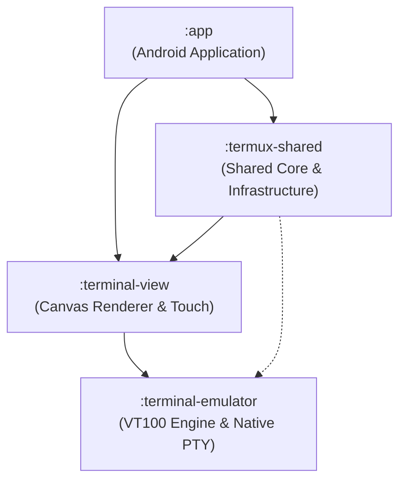
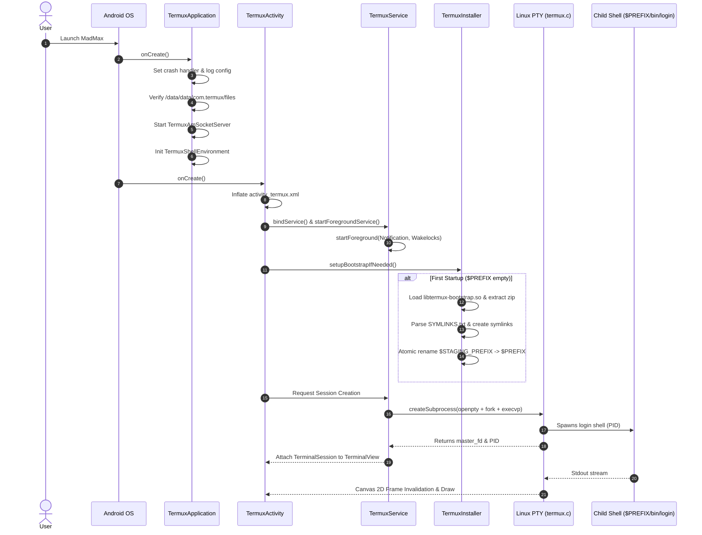

# MADMAX Engineering Architecture Blueprint

> **Document Classification:** Engineering Reference  
> **Target Version:** MadMax v1.0.0 (Based on Termux 0.118.0)  
> **Status:** Active Standard  

---

## 1. System Topology & Gradle Dependency Graph

MadMax is architected as a modular multi-tier platform decoupling POSIX terminal emulation from Android presentation and application logic:



### Module Responsibilities

```
+---------------------------------------------------------------------------------------+
| :app                                                                                  |
| - TermuxApplication (Startup lifecycle, Crash handler, Socket server)                 |
| - TermuxActivity (SingleTask UI Activity, DrawerLayout, Toolbar)                      |
| - TermuxService (Foreground Service, Wakelocks, Notification, TerminalSessions)       |
| - RunCommandService (Exported IPC Service guarded by RUN_COMMAND permission)          |
| - TermuxInstaller (Bootstrap extractor & symlink constructor)                         |
| - TermuxDocumentsProvider (Storage Access Framework document provider)                |
+---------------------------------------------------------------------------------------+
                                           │
                                           ▼
+---------------------------------------------------------------------------------------+
| :termux-shared                                                                        |
| - Execution Engine (ExecutionCommand, AppShell, TermuxShellManager)                   |
| - Environment Engine (TermuxShellEnvironment PATH/LD_LIBRARY_PATH exporter)           |
| - Settings Engine (TermuxAppSharedProperties, TermuxPropertyConstants)                |
| - Local Socket Server (TermuxAmSocketServer / local-socket.cpp)                       |
| - UI Components (ExtraKeysView, ReportActivity markdown viewer)                       |
+---------------------------------------------------------------------------------------+
                                           │
                                           ▼
+---------------------------------------------------------------------------------------+
| :terminal-view                                                                        |
| - TerminalView (Custom Android View, Touch Dispatch, IME InputConnection)             |
| - TerminalRenderer (Monospace glyph Canvas 2D drawer, Background rects, Cursor styles)|
| - GestureAndScaleRecognizer (Pinch-to-zoom font scaling, Double-tap, Long-press)      |
| - TextSelectionCursorController (Selection handles and copying)                       |
+---------------------------------------------------------------------------------------+
                                           │
                                           ▼
+---------------------------------------------------------------------------------------+
| :terminal-emulator                                                                    |
| - TerminalEmulator (ANSI / DEC VT100 State Machine, Primary & Alt Buffers)            |
| - TerminalBuffer & TerminalRow (Circular line memory, Codepoints, Text styles)        |
| - TerminalSession (PTY thread coordinator, ByteQueue)                                 |
| - KeyHandler (Android keycode -> ANSI escape byte sequences)                          |
| - WcWidth (East Asian Wide and Emoji column width calculation)                        |
| - termux.c (Native Linux openpty, setsid, fork, execvp, dup2, TIOCSWINSZ)             |
+---------------------------------------------------------------------------------------+
```

---

## 2. Process Model & Lifecycle Interactions



---

## 3. Terminal Rendering & PTY Data Flow

```
                                  PTY & RENDERING PIPELINE
                                  
  [USER INPUT]                                                [PTY PROCESS OUTPUT]
       │                                                               │
       ▼                                                               ▼
 ┌──────────────┐                                              ┌───────────────┐
 │ Soft Keyboard│                                              │ Child Process │
 │ / Extra Keys │                                              │ (e.g. bash)   │
 └──────┬───────┘                                              └───────┬───────┘
        │ KeyEvents / IME Commits                                      │ stdout / stderr
        ▼                                                              ▼
 ┌──────────────┐                                              ┌───────────────┐
 │ TerminalView │                                              │ Linux Kernel  │
 │  Input Layer │                                              │  /dev/pts/N   │
 └──────┬───────┘                                              └───────┬───────┘
        │ Keycodes & Modifiers                                         │ PTY Slave -> Master
        ▼                                                              ▼
 ┌──────────────┐                                              ┌───────────────┐
 │  KeyHandler  │                                              │   master_fd   │
 └──────┬───────┘                                              └───────┬───────┘
        │ ANSI Escape Byte Sequences                                   │ Native read()
        ▼                                                              ▼
 ┌──────────────┐                                              ┌───────────────┐
 │TerminalSession                                              │   ByteQueue   │
 │   write()    │                                              │ (Lock-free)   │
 └──────┬───────┘                                              └───────┬───────┘
        │                                                              │ Byte stream
        ▼                                                              ▼
 ┌──────────────┐                                              ┌───────────────┐
 │  master_fd   │                                              │TerminalEmulator│
 │ (PTY Master) │                                              │State Machine  │
 └──────┬───────┘                                              └───────┬───────┘
        │                                                              │ Update rows
        ▼                                                              ▼
 ┌──────────────┐                                              ┌───────────────┐
 │ Child Stdin  │                                              │TerminalBuffer │
 │  /dev/pts/N  │                                              │ (Line Memory) │
 └──────────────┘                                              └───────┬───────┘
                                                                       │ invalidate()
                                                                       ▼
                                                               ┌───────────────┐
                                                               │TerminalRenderer│
                                                               │(Canvas Draw)  │
                                                               └───────────────┘
```

---

## 4. Dual Settings Architecture

```
                       SETTINGS ARCHITECTURE
                                 │
         ┌───────────────────────┴────────────────────────┐
         ▼                                                ▼
 ┌──────────────────────────────┐        ┌──────────────────────────────┐
 │  Android SharedPreferences   │        │     Property Files (Disk)    │
 │ (XML in /data/data/.../sp/)  │        │   (~/.termux/termux.properties)│
 └──────────────┬───────────────┘        └──────────────┬───────────────┘
                │                                       │
                ▼                                       ▼
  Managed by:                            Managed by:
  - TermuxAppSharedPreferences           - TermuxAppSharedProperties
  - SettingsActivity                     - TermuxSharedProperties
  - Android Preference Fragments         - SharedPropertiesParser
                │                                       │
                ▼                                       ▼
  Stores:                                Stores:
  - UI Log Level                         - Extra Keys layout matrix
  - Crash reporting flags                - Bell action (beep, vibrate, ignore)
  - First-run bootstrap state            - Back/Volume keys behavior
  - Diagnostic preferences               - Terminal margins & font scaling
                                         - allow-external-apps toggle
                                         - Cursor style & blink rate
```

---

## 5. Bootstrap Packaging & Execution Pipeline

```
  BUILD TIME (Gradle / NDK)                               RUNTIME (First Launch)
┌──────────────────────────────────────┐                ┌──────────────────────────────────────┐
│ Task: downloadBootstraps             │                │ TermuxActivity.onCreate()            │
│ Downloads bootstrap-<arch>.zip       │                └──────────────────┬───────────────────┘
│ Validates SHA-256 Checksums          │                                   │
└──────────────────┬───────────────────┘                                   ▼
                   │                                    ┌──────────────────────────────────────┐
                   ▼                                    │ TermuxInstaller.setupBootstrap()     │
┌──────────────────────────────────────┐                │ Is $PREFIX/bin/login present?        │
│ Native Assembly Compilation          │                └──────────────────┬───────────────────┘
│ termux-bootstrap-zip.S (.incbin)     │                                   │ (No)
│ Embeds raw zip into .so              │                                   ▼
└──────────────────┬───────────────────┘                ┌──────────────────────────────────────┐
                   │                                    │ System.loadLibrary("termux-bootstrap")│
                   ▼                                    │ Streams raw zip into $STAGING_PREFIX │
┌──────────────────────────────────────┐                │ Reads SYMLINKS.txt & creates symlinks│
│ Output: libtermux-bootstrap.so       │                │ Renames $STAGING_PREFIX -> $PREFIX   │
│ Embedded in APK jniLibs              │                └──────────────────────────────────────┘
└──────────────────────────────────────┘
```

---

## 6. Security Boundaries & Target SDK 28 Constraint

* **Package Identity:** `com.termux` (Shared UID enabled across all plugins).
* **Target SDK Version:** `28` (Android 9.0 Pie).
* **Why SDK 28 is Pinned:** Android 10 (Target SDK 29+) enforces W^X (Write XOR Execute) memory restrictions preventing execution of dynamically created binaries in private application data directories (`/data/data/com.termux/files/usr/bin`). Target SDK 28 allows executing binaries without SELinux permission violations.
* **External Command Security:** The `RunCommandService` intent endpoint verifies caller permissions against `com.termux.permission.RUN_COMMAND` and checks user consent in `~/.termux/termux.properties` via `allow-external-apps=true`.
