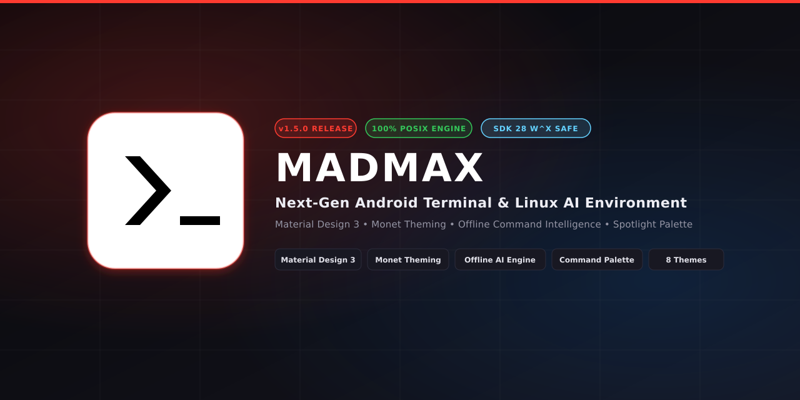

<p align="center">
  
</p>

<h1 align="center">⚡ MadMax — Next-Gen Android Terminal &amp; Linux AI Environment</h1>

<p align="center">
  <b>A modernized, production-grade Android terminal platform combining pristine upstream Termux POSIX emulation with Material Design 3, Monet dynamic wallpaper theming, an offline CLI intelligence engine, a Spotlight command palette, and a developer diagnostics hub.</b>
</p>

<p align="center">
  <a href="https://github.com/The-habib/Madmax/releases/tag/v1.5.0"></a>
  <a href="https://github.com/The-habib/Madmax/actions/workflows/release.yml"></a>
  <a href="gradle.properties"></a>
  <a href="https://m3.material.io"></a>
  <a href="LICENSE.md"></a>
</p>

<p align="center">
  <a href="#-quick-download-v150">📦 Download APKs</a> •
  <a href="#-key-highlights">⚡ Features</a> •
  <a href="#-terminal-theme-catalog">🎭 Themes</a> •
  <a href="#-ai-workspace--command-intelligence">🧠 AI Workspace</a> •
  <a href="#-system-architecture">🏗️ Architecture</a> •
  <a href="#-building-from-source">🛠️ Building</a> •
  <a href="#-roadmap">🗺️ Roadmap</a>
</p>

---

## 📦 Quick Download (`v1.5.0` Latest Release)

Pre-built, signed debug APKs are generated automatically by GitHub Actions across all supported Android architectures:

| Target Architecture | Device Type | APK Size | Direct Download |
|---|---|---|:---:|
| **Universal APK** | All Android Devices (All ABIs bundled) | `119.6 MB` | [📥 **Download Universal APK**](https://github.com/The-habib/Madmax/releases/download/v1.5.0/termux-app_apt-android-7-debug_universal.apk) |
| **ARM64 (`arm64-v8a`)** | Modern 64-bit Android Phones & Tablets | `37.1 MB` | [📥 **Download ARM64 APK**](https://github.com/The-habib/Madmax/releases/download/v1.5.0/termux-app_apt-android-7-debug_arm64-v8a.apk) |
| **ARMv7 (`armeabi-v7a`)** | Legacy 32-bit Android Devices | `34.1 MB` | [📥 **Download ARMv7 APK**](https://github.com/The-habib/Madmax/releases/download/v1.5.0/termux-app_apt-android-7-debug_armeabi-v7a.apk) |
| **x86_64** | 64-bit Android Emulators, PCs & ChromeOS | `37.0 MB` | [📥 **Download x86_64 APK**](https://github.com/The-habib/Madmax/releases/download/v1.5.0/termux-app_apt-android-7-debug_x86_64.apk) |
| **x86** | 32-bit Android Emulators | `36.3 MB` | [📥 **Download x86 APK**](https://github.com/The-habib/Madmax/releases/download/v1.5.0/termux-app_apt-android-7-debug_x86.apk) |
| **SHA-256 Checksums** | Integrity Verification Hashes | `430 B` | [📄 **SHA256SUMS.txt**](https://github.com/The-habib/Madmax/releases/download/v1.5.0/SHA256SUMS.txt) |

> [!TIP]
> Not sure which package to choose? Download the **Universal APK**, which runs on any Android phone running Android 5.0 through 15+.

---

## ⚡ Key Highlights

### 🎨 1. Material Design 3 & Monet Dynamic Colors
- **Material 3 Presentation Engine:** Modernized styling with `Theme.Material3.DayNight.NoActionBar`, rounded surface containers, and crisp tonal buttons.
- **Monet Dynamic Wallpaper Theming:** Automatically extracts and maps dynamic color palettes from the Android 12+ wallpaper into the terminal UI.
- **Pure OLED Dark Mode:** True obsidian `#000000` terminal background maximizing contrast and battery savings on AMOLED displays.

### 📑 2. Redesigned Session Drawer
- **Elevated Session Cards:** Material 3 session cards with rounded corners, ripple feedback, and process metadata.
- **Live Status Pills:** Real-time visual status badges distinguishing active shells (`RUNNING` in green) from closed processes (`EXITED` in red).
- **One-Tap Terminate:** Instant kill button (`x`) directly on session cards to close stuck processes without typing `exit`.
- **Integrated Brand Header:** Displays the signature MadMax logo badge, build tag, Quick Actions trigger, and AI Workspace launcher.

### ⌨️ 3. Tactile Hardware Keycaps Toolbar (Page 1)
- **Instant Control Bar:** Upper-row accessibility toolbar featuring tactile keycaps with monospace typography and crisp vector icons:
  - `MENU`: Launches the Quick Actions Hub.
  - `AI`: Opens the AI Command Workspace.
  - `CMD`: Triggers the Spotlight Command Palette.
  - `THEME`: Launches the Live Terminal Theme Switcher.
  - `PASTE` / `COPY`: Instant clipboard integration.
  - `CLEAR`: Clears the screen scrollback buffer.
  - `^C`: Immediate `SIGINT` (`\u0003`) interrupt.
  - `SNIPS`: Quick access to categorized CLI snippets.
  - `A+` / `A-`: Real-time font size scaling with visual preview.
  - `KBD`: Software keyboard toggle.

### 🔍 4. Spotlight Command Palette
- **Fuzzy Search Modal:** Search and execute commands, system actions, shortcuts, and scripts with instant real-time filtering (`Cmd+P` / Spotlight experience).
- **One-Tap Execution:** Tap any filtered command to execute it directly inside the active terminal session or copy to clipboard.

### 🎭 5. Curated Terminal Themes
- **8 Developer Palettes:** Select from 8 hand-crafted developer color schemes:
  1. **MadMax Cyber Dark** (Obsidian dark `#0E0E12` with cyber red `#FF3B30`)
  2. **Dracula** (Iconic purple & cyan `#282A36`)
  3. **Nord** (Arctic north-bluish `#2E3440`)
  4. **Catppuccin Mocha** (Modern coding pastel `#1E1E2E`)
  5. **One Dark Pro** (Atom-inspired dark `#282C34`)
  6. **Solarized Dark** (Precision cyan & green contrast `#002B36`)
  7. **Monokai Pro** (Vibrant high-contrast `#2D2A2E`)
  8. **Classic AMOLED** (Pure `#000000` deep black)
- **Live Memory & Disk Persistence:** Switches color matrices immediately in memory and writes to `~/.termux/colors.properties` for reboot persistence.

### 🧠 6. Built-in AI Workspace & Command Intelligence
- **100% Offline Command Intelligence:** Zero-latency parsing and flag decomposition for **70+ standard CLI binaries** (`ps`, `grep`, `kill`, `lsof`, `git`, `curl`, `tar`, `awk`, `find`, `netstat`, etc.).
- **Automated Error Diagnosis:** Intelligent regex engine that scans terminal stderr and exit code failures (`command not found`, `permission denied`, `port already in use`, `merge conflict`, `disk full`, `missing python/node modules`) into **1-tap automated fixes** (e.g. `pkg install <pkg> -y`).
- **Natural Language Generator:** Converts plain English requests (*"find files larger than 100MB"*, *"kill process on port 8080"*) into optimized shell commands.
- **Provider-Agnostic Engine:** Runs 100% locally with zero data leaving the device, with built-in connectors ready for Gemini, Ollama, and OpenAI.

### 🔍 7. Developer Diagnostics Dashboard
- **Hidden Diagnostic Inspector:** 5-tap easter egg on the drawer header (or via the dev icon button) displaying live device hardware, CPU ABIs, Target SDK 28 W^X compliance, RAM memory metrics, and dynamic feature flag states.
- **Markdown Export:** One-tap button to copy a complete system report to the clipboard for troubleshooting and issue reporting.

### 🛡️ 8. 100% Pristine Core Engine Protection
- **Zero Core Tampering:** The VT100/ANSI parser, POSIX PTY controller (`termux.c`), Unix socket bridge (`local-socket.cpp`), and bootstrap package installer remain strictly identical to upstream Termux.
- **Target SDK 28 Compliance:** Preserves binary execution in private application directories without triggering Android 10+ W^X memory restrictions.

---

## 🏗️ System Architecture

```mermaid
flowchart TD
    subgraph UI Layer [Material Design 3 + Monet]
        TA["TermuxActivity (Main Controller)"]
        Drawer["Material 3 Session Drawer"]
        Toolbar["Tactile Keycaps Bar (Page 1)"]
        Palette["Spotlight Command Palette"]
        QA["Quick Actions Center (5 Tabs)"]
        ThemeSheet["Terminal Theme Switcher (8 Themes)"]
        AIBS["AI Workspace (Explain / Generate / Diagnose)"]
    end

    subgraph Service & Extension Layer
        TSvc["TermuxService (Foreground Service / Wakelocks)"]
        MEM["MadMaxExtensionManager"]
        MFR["MadMaxFeatureRegistry (Dynamic Flags)"]
        AWM["AIWorkspaceManager / AICommandService"]
        OCI["OfflineCommandIntelligence (70+ Tools)"]
        AEA["AIErrorAnalyzer (Regex stderr Classifier)"]
    end

    subgraph Pristine Core Terminal Engine [100% Upstream Unmodified]
        TV["TerminalView (Android Canvas 2D Glyph Renderer)"]
        TE["TerminalEmulator (VT100 / ANSI State Machine)"]
        TB["TerminalBuffer (Circular Scrollback Memory)"]
        TSess["TerminalSession (PTY Stream Coordinator)"]
        JNI["termux.c (JNI POSIX openpty / fork / execvp)"]
    end

    subgraph Linux Userland Environment
        PTY["Linux PTY Slave (/dev/pts/*)"]
        Sysroot["$PREFIX (/data/data/com.termux/files/usr)"]
        Shell["bash / zsh / login / proot"]
    end

    TA <--> TSvc
    TA --> TV
    TV <--> TSess
    TSess <--> TE
    TE <--> TB
    TSess <--> JNI
    JNI <--> PTY
    PTY <--> Shell
    Shell <--> Sysroot

    TA --> Drawer & Toolbar & Palette & QA & ThemeSheet & AIBS
    MEM --> MFR & AWM
    AIBS --> AWM
    AWM --> OCI & AEA
    QA & Palette & AIBS -->|session.write()| TSess
```

---

## 🎭 Terminal Theme Catalog

MadMax includes 8 hand-tuned terminal palettes accessible via the `THEME` toolbar button:

| Theme | Description | Background | Foreground | Accent |
|---|---|:---:|:---:|:---:|
| **MadMax Cyber Dark** | Signature obsidian dark theme with cyber red accents | `#0E0E12` | `#F0F0F4` | `#FF3B30` |
| **Dracula** | Iconic vampire dark theme with purple and cyan tones | `#282A36` | `#F8F8F2` | `#BD93F9` |
| **Nord** | Arctic north-bluish calm developer palette | `#2E3440` | `#D8DEE9` | `#88C0D0` |
| **Catppuccin Mocha** | Soothing modern pastel palette for high-focus coding | `#1E1E2E` | `#CDD6F4` | `#CBA6F7` |
| **One Dark Pro** | Deep Atom-inspired dark theme with soft tones | `#282C34` | `#ABB2BF` | `#61AFEF` |
| **Solarized Dark** | Precision cyan/green contrast scheme | `#002B36` | `#839496` | `#2AA198` |
| **Monokai Pro** | High-contrast vibrant coding palette | `#2D2A2E` | `#FCFCFA` | `#FFD866` |
| **Classic AMOLED** | Pitch-black background optimized for battery life | `#000000` | `#FFFFFF` | `#0A84FF` |

---

## 🛠️ Building From Source

### Prerequisites
- **JDK 17** (`openjdk-17-jdk` / Temurin 17)
- **Android SDK** (API 36, Build-Tools 35.0.0)
- **Android NDK** (`29.0.14206865`)

### Build Commands
```bash
# Clone repository
git clone https://github.com/The-habib/Madmax.git
cd Madmax

# Set Android SDK path
echo "sdk.dir=$ANDROID_HOME" > local.properties

# Run Unit Tests
./gradlew testDebugUnitTest

# Assemble all Debug APKs
./gradlew assembleDebug
```

Compiled APKs will be output to `app/build/outputs/apk/debug/`:
- `termux-app_apt-android-7-debug_universal.apk`
- `termux-app_apt-android-7-debug_arm64-v8a.apk`
- `termux-app_apt-android-7-debug_armeabi-v7a.apk`
- `termux-app_apt-android-7-debug_x86_64.apk`
- `termux-app_apt-android-7-debug_x86.apk`

---

## 🛡️ Non-Negotiable Core Boundaries

To preserve seamless upstream synchronization with `termux/termux-app`:

```
┌───────────────────────────────────────────────────────────────────────────────────┐
│ 🔴 STRICTLY PROTECTED ZONES — DO NOT ALTER                                        │
├───────────────────────────────────────────────────────────────────────────────────┤
│ 1. `terminal-emulator/` (VT100 parser, circular buffers, TerminalSession)        │
│ 2. `terminal-emulator/src/main/jni/termux.c` (Native PTY fork / execvp bindings)  │
│ 3. `termux-shared/src/main/cpp/local-socket.cpp` (am socket server)               │
│ 4. `targetSdkVersion=28` in `gradle.properties` (W^X memory protection constraint)│
│ 5. Bootstrap extraction in `TermuxInstaller.java` & downloadBootstraps task       │
└───────────────────────────────────────────────────────────────────────────────────┘
```

---

## 🗺️ Roadmap

- [x] **Milestone 1.0:** Decoupled Extension Architecture & Material 3 Theme Upgrade
- [x] **Milestone 1.1:** Android 12+ Monet Dynamic Colors & Redesigned Session Drawer
- [x] **Milestone 1.2:** In-Terminal AI Workspace, Offline Command Intelligence & Error Analyzer
- [x] **Milestone 1.3:** Terminal Accessibility Toolbar, Hardware Keycaps & CLI Snippets
- [x] **Milestone 1.4:** Spotlight Command Palette & 8-Theme Terminal Switcher
- [x] **Milestone 1.5:** End-to-End Rebrand to MadMax & Terminal Prompt Logo Integration
- [ ] **Milestone 2.0:** Remote LLM Provider Connectors (Ollama localhost & Gemini Cloud API)
- [ ] **Milestone 2.1:** Deep GitHub PR Review & Codespace Manager
- [ ] **Milestone 3.0:** Reactive Unix Socket Plugin Subsystem

---

## 📄 License

MadMax is licensed under the **GNU General Public License v3.0** (GPLv3). See [LICENSE.md](LICENSE.md) for details.

