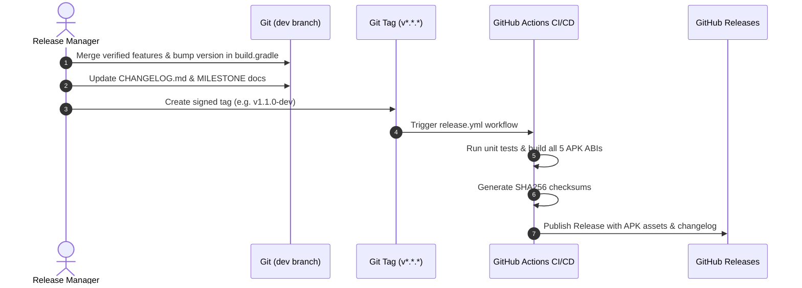

# MadMax Release & Deployment Process

This document outlines the end-to-end release lifecycle for MadMax versions, from development branch staging to GitHub Releases and APK artifact distribution.

---

## 1. Release Lifecycle Diagram



---

## 2. Step-by-Step Release Guide

### Step 1: Version Verification & Bump
1. Open [`app/build.gradle`](file:///workspaces/Madmax/app/build.gradle) and verify `versionName` (e.g. `1.1.0`) and `versionCode`.
2. Update [`MadMaxConstants.java`](file:///workspaces/Madmax/app/src/main/java/com/termux/app/madmax/core/MadMaxConstants.java) with `MADMAX_VERSION`.

### Step 2: Changelog & Release Notes
1. Update [`CHANGELOG.md`](file:///workspaces/Madmax/CHANGELOG.md) with merged features and fixes.
2. Ensure [`.madmax/reports/CHECKSUMS.md`](file:///workspaces/Madmax/.madmax/reports/CHECKSUMS.md) is updated.

### Step 3: Local Verification Gate
```bash
source /etc/profile.d/android_env.sh
./gradlew clean testDebugUnitTest assembleDebug
```

### Step 4: Tagging & Pushing
```bash
git checkout dev
git pull origin dev
git tag -a v1.1.0-dev -m "Release MadMax v1.1.0-dev: Material 3 & Extension Foundation"
git push origin dev --tags
```

### Step 5: Automated GitHub Actions Distribution
* The `release.yml` GitHub Action triggers automatically on the tag push.
* Builds all 5 ABI packages: Universal, `arm64-v8a`, `armeabi-v7a`, `x86_64`, `x86`.
* Publishes the GitHub Release with attached APKs and `SHA256SUMS.txt`.
