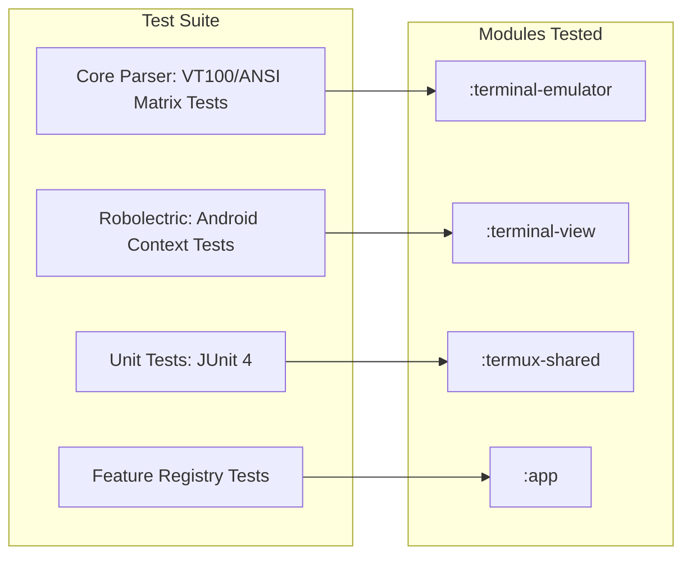

# MadMax Automated Testing & Quality Assurance Guide

MadMax enforces strict automated quality gates to prevent regression in terminal emulation, socket communications, and presentation layers.

---

## 1. Test Architecture



---

## 2. Running Automated Tests

### 2.1 Run All Unit Tests Across Modules
```bash
source /etc/profile.d/android_env.sh
./gradlew testDebugUnitTest
```

### 2.2 Run Tests for Specific Module
```bash
# Terminal Emulator ANSI/VT100 tests
./gradlew :terminal-emulator:testDebugUnitTest

# MadMax App & Extension tests
./gradlew :app:testDebugUnitTest
```

### 2.3 Run Specific Test Class
```bash
./gradlew :app:testDebugUnitTest --tests "com.termux.app.madmax.MadMaxFeatureRegistryTest"
./gradlew :app:testDebugUnitTest --tests "com.termux.app.madmax.SystemMetricsCollectorTest"
```

---

## 3. Test Coverage Areas

1. **Terminal Core Matrix:** Unicode character wrapping, double-width glyphs, surrogate pairs, scroll regions, DECCOLM resets, SGR 24-bit truecolor parsing.
2. **MadMax Extension Layer:** Feature enum definitions, thread-safe cache loads, SharedPreferences synchronization, listener callbacks.
3. **Developer Diagnostics:** Markdown generation, system metric string formatting, ABI detection.
