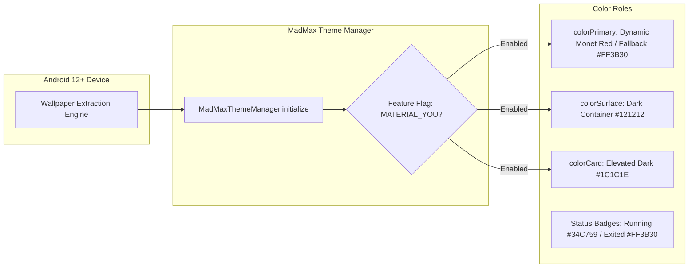

# MadMax Presentation & UI Architecture

MadMax upgrades the visual presentation of Termux to **Material Design 3** while isolating the terminal rendering loop to prevent latency, drop frames, or font distortions.

---

## 1. Presentation Layer Architecture

```mermaid
graph TD
    subgraph Activity Window
        TA[TermuxActivity: Theme.Material3.DayNight.NoActionBar]
        DL[DrawerLayout]
    end

    subgraph Navigation Drawer (280dp)
        HDR[MadMax Branded Header + Version Badge]
        QAK[Quick Actions: Diagnostics, Settings]
        LST[ListView: item_terminal_sessions_list]
        FTR[Footer: MaterialButton Tonal / Filled]
    end

    subgraph Terminal Canvas Surface
        TV[TerminalView: Canvas Monospace Rendering]
        TB[TerminalBuffer: In-Memory Glyph Matrix]
    end

    TA --> DL
    DL --> HDR
    DL --> QAK
    DL --> LST
    DL --> FTR
    DL --> TV
    TV --> TB
```

---

## 2. Color System & Monet Dynamic Theming



---

## 3. UI Guidelines

- **Terminal Viewport Independence:** The terminal canvas is rendered directly on a dedicated surface with pure `#000000` background for maximum OLED contrast and power efficiency.
- **Drawer Cards:** Every session row is styled as a standalone 12dp rounded card with an active border highlight and live process status dot.
- **Settings Hierarchy:** Settings are organized using Material 3 `PreferenceCategory` groups with explicit iconography and summaries.
